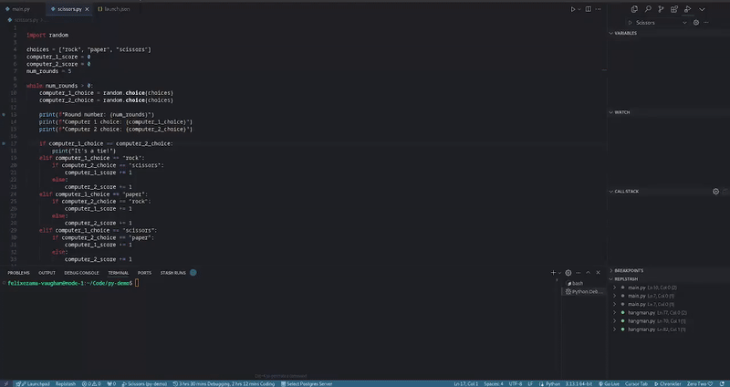
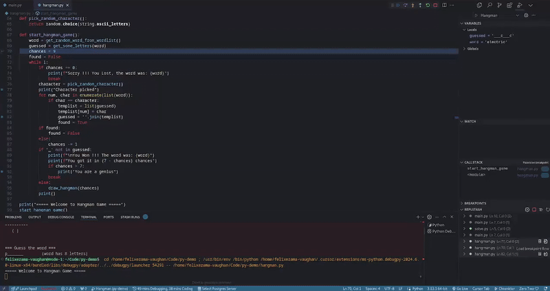
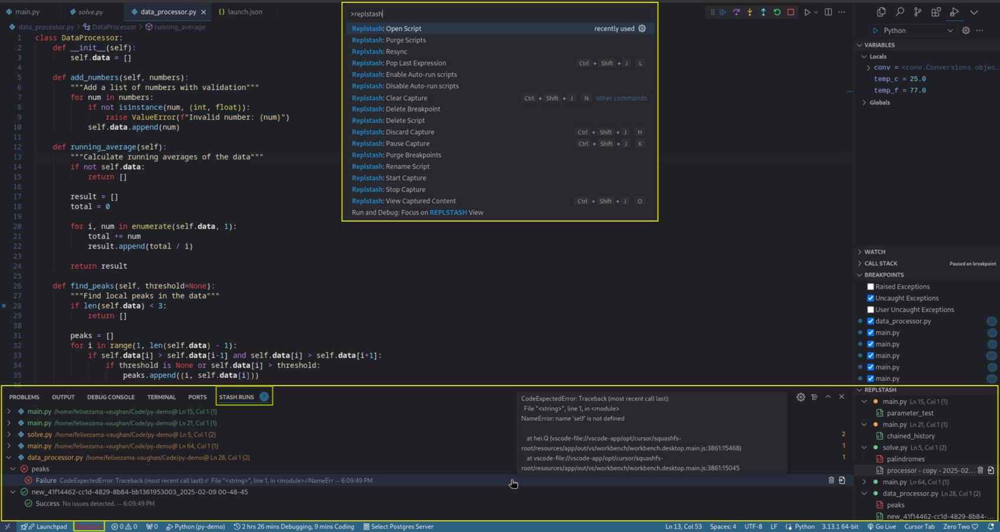

&nbsp;&nbsp;

# Replstash: Save and Re-run Debug Scripts

A Visual Studio Code extension to quickly save, edit and rerun [REPL](https://en.wikipedia.org/wiki/Read%E2%80%93eval%E2%80%93print_loop) content captured on breakpoints from the debug console.

 

Demonstrates moving debug logs to a REPL script and using it to calculate and set game moves automatically.

 

Just some harmless fun.

 

Views, Panels and commands in the command palette.

 

## Installation

Install directly from the Visual Studio Code Marketplace or via the extensions panel in VS Code.

## Usage

The workflow is designed to be streamlined through VS Code's command palette and keyboard shortcuts. While you can browse and edit your saved scripts and breakpoints at any time, the core functionality requires an active debugging session.

Here's how it works:

1. Start a debugging session
2. Hit a breakpoint to pause execution
3. Begin capturing content using either:
   - The colored `Replstash` status bar icon
   - Keyboard shortcuts
   - Command palette commands

The `Replstash` status bar icon serves as a visual indicator of your current capture state. When active, it will change color to show that capture is in progress.

You can interact with your captured content through:
- The debug sidebar views
- The bottom panel interface

## Use Cases 

- Set snippets to change variables, log messages, and import dependencies on hit breakpoints
- Save parts of code you want to remove but keep executable
- Test multiple execution paths when paused on a breakpoint
- Eliminate repetitive commands ran in the console
- Monitor and modify program and system state between breakpoints

## Features 

- Palette commands to start, stop, save and auto-run REPL content
- Panel on the debug sidebar to manage and execute scripts
- Container on bottom panel to view content execution results and stack traces
- Status bar indicates capture state
- Supports Python, Bash, JavaScript and other REPL-supported languages
- Visual indicators in the debug panel show execution status and results of each script run

### Key Commands

| Command | Palette | Shortcut |
|---------|---------|----------|
| Start Capture | `Replstash: Start Capture` | `ctrl + shift + j + j` |
| Stop Capture | `Replstash: Stop Capture` | `ctrl + shift + j + j` |
| Pause Capture | `Replstash: Pause Capture` | `ctrl + shift + j + k` |
| View Captured Content | `Replstash: View Captured Content` | `ctrl + shift + j + o` |
| Clear Capture | `Replstash: Clear Capture` | `ctrl + shift + j + n` |
| Pop Last Expression | `Replstash: Pop Last Expression` | `ctrl + shift + j + l` |
| Discard Capture | `Replstash: Discard Capture` | `ctrl + shift + j + h` |
| Toggle Auto-Run | `Replstash: Toggle Auto-Run` | `ctrl + shift + j + m` |

### Additional Functions

- Delete a breakpoint via palette or debug panel
- Edit a saved script via palette or debug panel
- Delete a saved script via palette or debug panel
- Resync breakpoints via palette or debug panel
- Rename a saved script via palette or debug panel
- Run a saved script from the debug panel
- Run all saved scripts from the debug panel

**Note:** Multiple scripts can be captured per breakpoint. Once saved, they appear in the Replstash panel on the debug sidebar. From here, you can edit, run, rename and delete scripts. Scripts can be set to run automatically when their associated breakpoint is hit. Both scripts and breakpoints can be activated/deactivated to control execution eligibility when automatic is enabled.

## Extension Settings

This extension contributes the following commands and functionalities:

### Capture Management
- `replstash.startCapture`: Start capturing debug console content
- `replstash.pauseCapture`: Pause capturing debug console content
- `replstash.stopCapture`: Stop capturing debug console content
- `replstash.outputCapture`: View captured content
- `replstash.clearCapture`: Clear captured content
- `replstash.discardCapture`: Discard captured content
- `replstash.clearLastExp`: Clear last captured expression

### Script Management
- `replstash.editSavedScript`: Edit saved REPL script
- `replstash.deleteSavedScript`: Delete saved REPL script
- `replstash.renameSavedScript`: Rename saved REPL script
- `replstash.runScripts`: Run saved REPL scripts
- `replstash.openScripts`: Open saved REPL scripts
- `replstash.copyScripts`: Copy REPL scripts

### Breakpoint Management
- `replstash.deleteBreakpoint`: Delete Replstash breakpoint
- `replstash.resyncBreakpoints`: Resync Replstash breakpoints
- `replstash.purgeBreakpoints`: Purge all Replstash breakpoints
- `replstash.goTo`: Go to breakpoint in file
- `replstash.jumpToBreakpoint`: Jump to breakpoint

### View Controls
- `replstash.toggleBreakpointTreeViewMode`: Toggle breakpoint tree view mode
- `replstash.toggleReplTreeViewMode`: Toggle REPL run tree view mode
- `replstash.toggleElementActive`: Toggle script or breakpoint active

## Reporting Issues

Report any issues on the GitHub [issues page](https://github.com/FelixVaughan/Replstash/issues). Please follow the provided template and include as much relevant information as possible.

## Contributing

The source code for this extension is hosted on [GitHub](https://github.com/FelixVaughan/Replstash). Contributions, pull requests, suggestions, and bug reports are greatly appreciated.

1. Post any issues and suggestions to the GitHub [issues page](https://github.com/FelixVaughan/Replstash/issues)
2. To contribute, fork the project and create a pull request back to master
3. While there is no official contribution guide yet, please follow standard open source norms and be respectful in any comments

## License

This project is licensed under the MIT License - see the [LICENSE](LICENSE) file for details.

## Acknowledgements

[Icon](https://www.flaticon.com/free-icons/scenario) created by [RaftelDesign](https://www.flaticon.com/authors/rafteldesign) - Flaticon